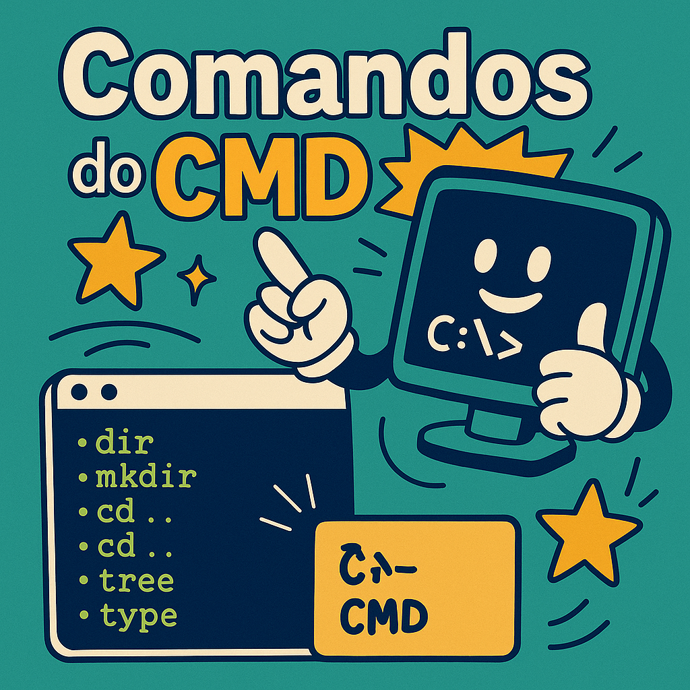
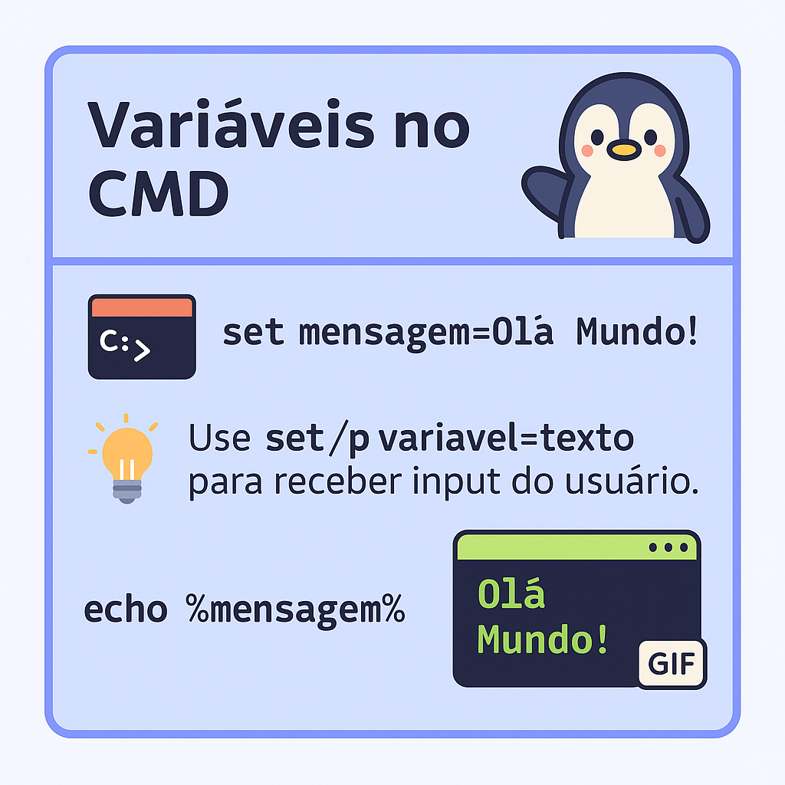
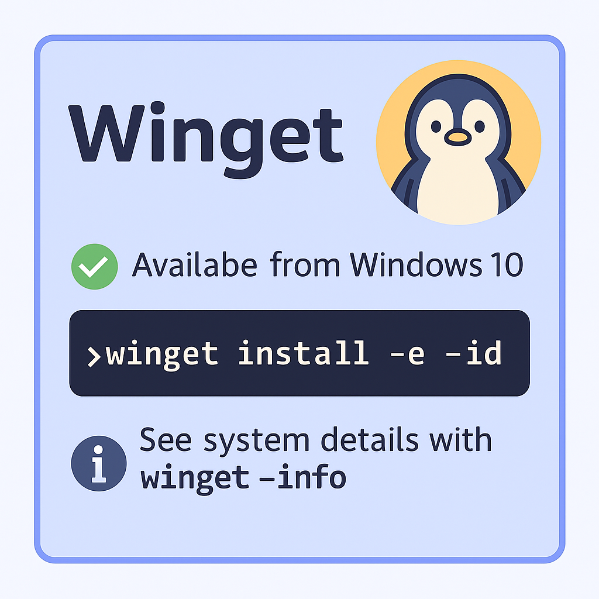

<h1 align="center">🖥️ Guia Interativo do CMD, PowerShell e Terminais</h1>

<p align="center">Um repositório criado pra tornar o terminal menos assustador e mais divertido!<br>
Comandos, scripts `.bat`, comparações entre CLIs e muito mais — com imagens, gifs e exemplos ilustrados 🧠💡</p>

---

## 📌 Comandos Essenciais do CMD
<p align="left">
  
</p>

<details>
<summary><strong>👀 Clique para expandir os principais comandos</strong></summary>

```bash
dir           # Lista arquivos
mkdir         # Cria diretório
cd ..         # Volta uma pasta
tree          # Mostra estrutura
type arquivo  # Lê conteúdo
more arquivo  # Lê por páginas
copy A B      # Copia
rename A B    # Renomeia
move A B      # Move
del arquivo   # Apaga
cls           # Limpa a tela
systeminfo    # Info do sistema
date          # Exibe/altera data
find "txt" A  # Busca texto
echo msg      # Exibe mensagem
notepad       # Abre bloco de notas
exit          # Fecha o terminal
````

</details>


---

## 🧪 Scripts `.BAT` — Automatize com Estilo

```bat
@echo off
set nome=Visitante
echo Olá %nome%!
```

### Interação com usuário:

```bat
set /p usuario=Digite seu nome:
echo Bem-vindo(a), %usuario%!
```

### Tratamento de erros:

```bat
IF %ERRORLEVEL% NEQ 0 (
  echo Erro na execução!
)
```

---

## 🔧 Variáveis no CMD

```bat
set mensagem=Olá Mundo!
echo %mensagem%
```

💡 *Use `set /p variavel=texto` para receber input do usuário.*

<p align="left">
  
</p>

---

## 📦 Winget – Gerenciador de Pacotes (Windows 10+)

```bash
winget install -e --id <nome>
winget --info
```

---

## 🍫 Chocolatey via PowerShell

### Instalação:

```powershell
Set-ExecutionPolicy Bypass -Scope Process -Force;
iex ((New-Object System.Net.WebClient).DownloadString('https://community.chocolatey.org/install.ps1'))
```

### Exemplos:

```bash
choco install nodejs
choco list
choco uninstall nome
```

---

## ⚖️ Comparativo de Terminais

<table>
  <tr>
    <th>Terminal</th><th>Sistema</th><th>Destaques</th>
  </tr>
  <tr>
    <td>🐧 Bash</td><td>Linux/macOS</td><td>Scripts leves, Unix-like</td>
  </tr>
  <tr>
    <td>🪟 CMD</td><td>Windows</td><td>Simples, legado</td>
  </tr>
  <tr>
    <td>⚡ PowerShell</td><td>Win/macOS/Linux</td><td>Baseado em objetos, moderno</td>
  </tr>
  <tr>
    <td>🐘 Zsh</td><td>Linux/macOS</td><td>Customizável com temas</td>
  </tr>
  <tr>
    <td>🌊 Fish</td><td>Linux/macOS</td><td>Sintaxe intuitiva, moderna</td>
  </tr>
  <tr>
    <td>🐍 Python CLI</td><td>Todos</td><td>Scripts robustos, CLI tools</td>
  </tr>
</table>

---

## 🧰 Ferramentas Recomendadas

✅ **Para turbinar seu terminal**:

* `CMDer` – Interface mais amigável pro CMD
* `Windows Terminal` – Terminal oficial da Microsoft (com abas!)
* `WSL` – Subsystem Linux no Windows
* `apt` e `sudo` – Administração no WSL

---

## 🖼️ Galeria

📷 Confira os visuais na [pasta de imagens](./img)

| Visual                             | Descrição                 |
| --------------------------------- | ------------------------- |
|        | Variáveis no CMD          |
|           | Uso do Winget             |


---

## 🤝 Contribua

Gosta de terminal, automação ou design técnico?
Contribua com melhorias, correções ou novas artes!
A galera que tá começando vai agradecer 🚀

---

## 🌟 Curtiu?

⭐ Dê uma estrela no repositório se esse conteúdo te ajudou!
📣 Compartilhe com colegas devs que querem aprender terminal sem sofrer!

---

<div align="center">
  Feito com carinho por cssbreno
  
</div>
